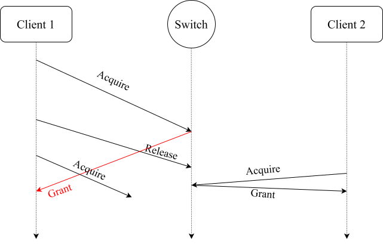

# VeriNC Real System Violation Reproduction: FarReach

This repository is cloned from [FarReach's official repository](https://github.com/LGN520/farreach-public).

## Prequisites

Please first refer to the README file of the main branch for general instructions about this project.

## Build Docker Image

Make sure you are in the root directory of this repository and run:

```bash
docker build -t dpdk:v21.11.4 -f dpdk-v21.11.4.Dockerfile .
docker build -t farreach-client-server:latest -f client-server.dockerfile .
```

Replace the `tofino:20251025` on the first line of `tofino.dockerfile` with the Docker image of Barefoot SDE you are using (e.g., `sde:9.7.0`), then run:

```bash
docker build -t farreach-tofino:latest -f farreach-tofino.dockerfile .
```

## Setup

Replace `<sde_name>` with the name of the Docker image of Barefoot SDE (e.g., `sde:9.7.0`) and run:

```bash
bash project_setup.sh <sde_name>
```

This process takes around 80 seconds.

## Run Experiment

Execute the following command to run the experiment:

```bash
sudo containerlab deploy; sudo containerlab destroy
```

This process takes around 300 seconds.

## Result Analysis

In `log/violation.log`, you should see logs similar to the following:

```
[44865237213773][FarreachClient][SEND][READ] key=user1
[44865238112283][FarreachClient][SEND][UPDATE] key=user1 value=2b593d3c52693b3a
[44865603683582][FarreachClient][RECV][READ] key=user1 value=7676767676767676
[44865699481819][FarreachClient][RECV][UPDATE] key=user1 value=2b593d3c52693b3a
[44865700788095][FarreachClient][SEND][READ] key=user1
[44865736166473][FarreachClient][RECV][READ] key=user1 value=7676767676767676
```

The UPDATE has terminated but the next READ does not obtain the latest value, violating cache consistency.

You may refer to other log files in the `log/` directory for more detailed information.

## Network Timing Diagram


